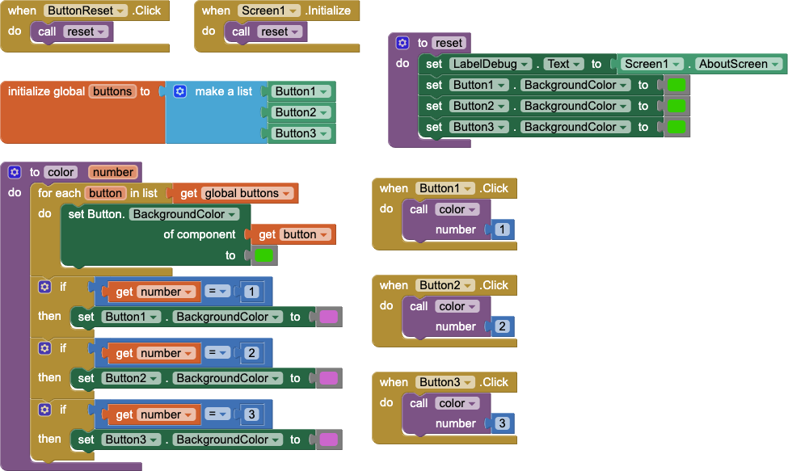
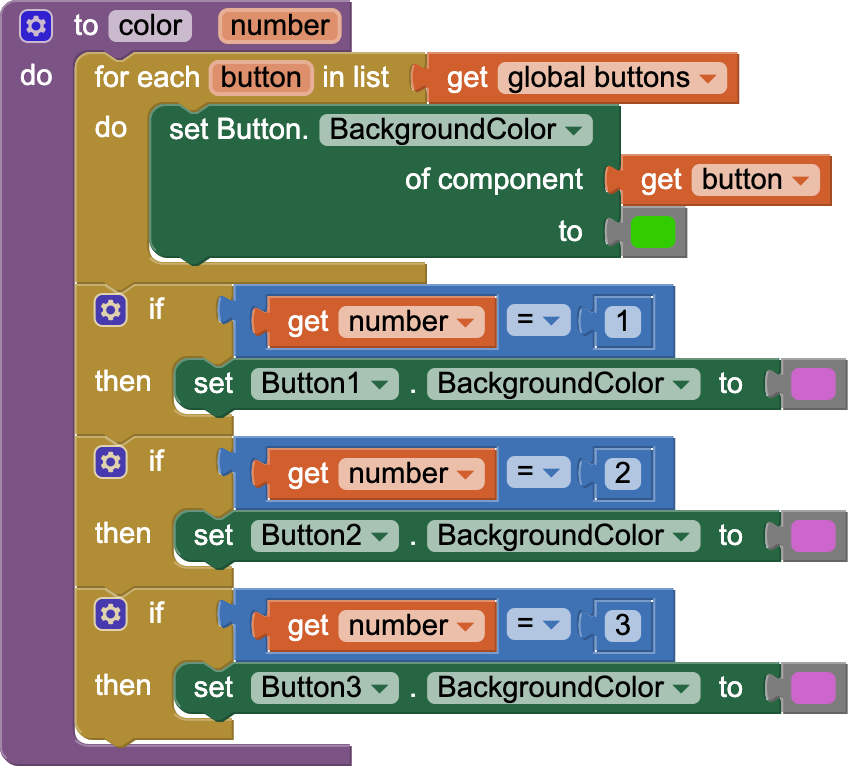
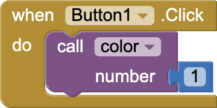
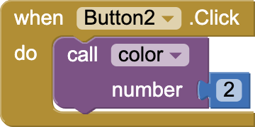

# `APCSPExample`

## About this app

The `APCSPExample` app is described in the `Screen1.AboutScreen`.

> This trivial app illustrates all aspects of the APCS-P requirements for the Create Performance Task: • List storing and access used to manage the complexity of the program; • A procedure w/ a parameter that is called from different places with different values and whose behavior varies based on the value of the parameter; and • An algorithm that includes sequencing, selection, and repetition.

## Code

- The *Reset* `Button` invokes the *reset* procedure, which initializes all the `Button.BackgroundColor`s.
- `Button1`, `Button2`, and `Button3` invoke the *color* procedure to (a) initialize *all* `Button.BackgroundColor`s and (b) change the `Button.BackgroundColor` for *that* `Button`.

Meeting the criteria for the APCS-P Create Performance Task [rubric](https://apcentral.collegeboard.org/pdf/ap-computer-science-principles-2021-create-performance-task-scoring-guidelines.pdf) involves:

- Row 2 &mdash; In the program code (above), the `buttons` list is *initialized* as a global variable. The `buttons` list is *used* in the *color* procedure to initialize the `Button.BackgroundColor`s of all buttons any time *any* button is clicked.

---

-  **Row 3** &mdash; All `Button` components that have their colors' changed are stored in the `buttons` list. Storing the `Button` components in a list obviates the need for individual variables for each component and facilitates adding additional `Button` components with additional functionality without making major changes to the code.

---

-  **Row 4** &mdash; {:height="25%" width="25%"}  The *color* procedure has a single *number* parameter which is set when it is called from each of the `Button.Clicked` handlers. **Note**: *The function of this program is trivial, so the contribution to the overall functionality of the program is also trivial.*

---

-  **Row 5** &mdash;  The *color* procedure initializes the `Button.BackgroundColor`s of *all* buttons by iterating through the `buttons` list setting the `Button.BackgroundColor` of each `Button` in turn. The rest of the sequence of blocks in the *color* procedure consists of a series of selections that test the value of the `number` parameter and react differently (set the `Button.BackgroundColor` of a differnt `Button`) based on its value.

---

-  **Row 6** &mdash;   In each call to the *color* procedure the *number* parameter is given a different value. The result of the call to  is to change the `Button.BackgroundColor` of `Button1`.  The result of the call to  is to change the `Button.BackgroundColor` of `Button2`. **Note**: *The function of this program is trivial, so the result of each call to the selected procedure is also trivial.*

## Designer

All components retain their default properties, &mdash; except `Width` and `Height` set to `Fill parent...` where necessary to center UX components, `Button` text(s) changed from their defaults(s), and `Screen1.AboutScreen` set to the explanatory text (above).

[&#128279; permalink](https://psb-david-petty.github.io/mit-app-inventor/APCSPExample/) and [&#128297; repository](https://github.com/psb-david-petty/mit-app-inventor/tree/master/APCSPExample) for this page.
