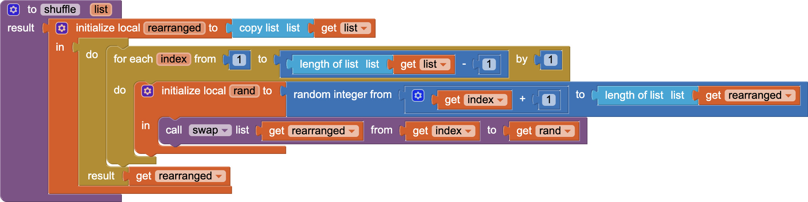
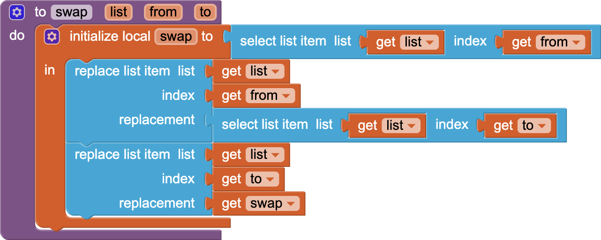

# `APCSPStroopExample`

## About this app

The `APCSPStroopExample` app is described in the `Screen1.AboutScreen`.

> This app ​demonstrates '&hellip;the delay in reaction time between congruent and incongruent stimuli​' known as the <a href="https://en.wikipedia.org/wiki/Stroop_effect">Stroop Effect</a> &mdash; try​ to say the <strong>color</strong> of the word, not the word itself.​   The app illustrates all aspects of the APCS-P requirements for the Create Performance Task: • List storing and access used to manage the complexity of the program; • A procedure w/ a parameter that is called from different places with different values and whose behavior varies based on the value of the parameter; and • An algorithm that includes sequencing, selection, and repetition.

## Code

- The *Reset* `Button` invokes the *reset* procedure, which invokes the *stroop* procedure to shuffle the color names and their colors.
- `Button1`, `Button2`, `Button3`, `Button4`, `Button5`, `Button6`, and `Button7` do nothing, but provide the canvas for the names and their colors.
- The *Matching* `Button` invokes the *stroop* procedure with a flag specifying that the word colors match the word names.
- The *Shuffled* `Button` invokes the *stroop* procedure with a flag specifying that the word colors *do not* match the word names.

## Scoring

Meeting the criteria for the APCS-P Create Performance Task [rubric](https://apcentral.collegeboard.org/media/pdf/ap22-sg-computer-science-principles.pdf) involves:

- **Row 1** &mdash; The purpose of the program is to demonstrate the [Stroop Effect](https://en.wikipedia.org/wiki/Stroop_effect), '&hellip;the delay in reaction time between congruent and incongruent stimuli.' The classic experiment demonstrated by John Ridley Stroop in 1935 asks subjects to say the *color* of the text under two conditions: where the color matches the text and where the color does not match the text. The function of the program involves clicking the two `Button`s: *Matching* or *Shuffle* and saying the *color* of each of the words in turn.

---

- **Row 2** &mdash; In the program code for the `shuffle` procedure, the `rearranged` list is *initialized* as a local variable. The `buttons` list is *used* in the *color* procedure to initialize the `Button.BackgroundColor`s of all buttons any time *any* button is clicked.

---

-  **Row 3** &mdash; All `Button` components that have their colors' changed are stored in the `buttons` list. Storing the `Button` components in a list obviates the need for individual variables for each component and facilitates adding additional `Button` components with additional functionality without making major changes to the code.

---

-  **Row 4** &mdash; [{:width="400px"}](https://github.com/psb-david-petty/mit-app-inventor/blob/master/APCSPExample/color.png) [{:width="200px"}](https://github.com/psb-david-petty/mit-app-inventor/blob/master/APCSPExample/Button1.png) The *color* procedure has a single *number* parameter which is set when it is called from each of the `Button.Clicked` handlers. **Note**: *The function of this program is trivial, so the contribution to the overall functionality of the program is also trivial.*

---

-  **Row 5** &mdash; [{:width="400px"}](https://github.com/psb-david-petty/mit-app-inventor/blob/master/APCSPExample/color.png) The *color* procedure initializes the `Button.BackgroundColor`s of *all* buttons by iterating through the `buttons` list setting the `Button.BackgroundColor` of each `Button` in turn. The rest of the sequence of blocks in the *color* procedure consists of a series of selections that test the value of the `number` parameter and react differently (set the `Button.BackgroundColor` of a differnt `Button`) based on its value.

---

-  **Row 6** &mdash; [{:width="200px"}](https://github.com/psb-david-petty/mit-app-inventor/blob/master/APCSPExample/Button1.png) [{:width="200px"}](https://github.com/psb-david-petty/mit-app-inventor/blob/master/APCSPExample/Button2.png) In each call to the *color* procedure the *number* parameter is given a different value. The result of the call to [{:width="200px"}](https://github.com/psb-david-petty/mit-app-inventor/blob/master/APCSPExample/color1.png) is to change the `Button.BackgroundColor` of `Button1`.  The result of the call to [{:width="200px"}](https://github.com/psb-david-petty/mit-app-inventor/blob/master/APCSPExample/color2.png) is to change the `Button.BackgroundColor` of `Button2`. **Note**: *The function of this program is trivial, so the result of each call to the selected procedure is also trivial.*

## Designer

All components retain their default properties, &mdash; except `Width` and `Height` set to `Fill parent...` where necessary to center UX components, `Button` text(s) changed from their defaults(s), and `Screen1.AboutScreen` set to the explanatory text (above).

[&#128279; permalink](https://psb-david-petty.github.io/mit-app-inventor/APCSPExample/), [&#128297; repository](https://github.com/psb-david-petty/mit-app-inventor/tree/master/APCSPExample), and [{:width="36px"} `.AIA`](https://psb-david-petty.github.io/mit-app-inventor/APCSPExample/APCSPExample.aia) for this page.
