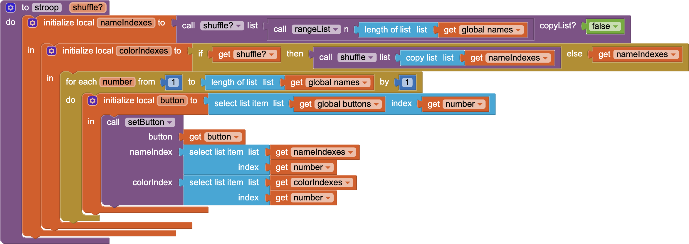

# `APCSPStroopExample`

## About this app

The `APCSPStroopExample` app is described in the `Screen1.AboutScreen`.

> This app ​demonstrates '&hellip;the delay in reaction time between congruent and incongruent stimuli​' known as the <a href="https://en.wikipedia.org/wiki/Stroop_effect">Stroop Effect</a> &mdash; try​ to say the <strong>color</strong> of the word, not the word itself.​   The app illustrates all aspects of the APCS-P requirements for the Create Performance Task: • List storing and access used to manage the complexity of the program; • A procedure w/ a parameter that is called from different places with different values and whose behavior varies based on the value of the parameter; and • An algorithm that includes sequencing, selection, and repetition.

## Code (PC)

- The *Reset* `Button` invokes the *reset* procedure, which invokes the *stroop* procedure to shuffle the color names and their colors.
- `Button1`, `Button2`, `Button3`, `Button4`, `Button5`, `Button6`, and `Button7` do nothing, but provide the canvas for the names and their colors.
- The *Matching* `Button` invokes the *stroop* procedure with a flag specifying that the word colors match the word names.
- The *Shuffled* `Button` invokes the *stroop* procedure with a flag specifying that the word colors *do not* match the word names.

## Written response (WR)

The submission for the *APCS-P Create Performance Task* includes a [written response](https://apcentral.collegeboard.org/media/pdf/ap-csp-student-task-directions.pdf#page=7) to questions 3a (i-iii), 3b (i-v), 3c (i-iv), and 3d (i-iii) to meet the requirements of the [scoring guidelines](https://apcentral.collegeboard.org/media/pdf/ap22-sg-computer-science-principles.pdf). 

### Row 1

- The purpose of the program is to demonstrate the [Stroop Effect](https://en.wikipedia.org/wiki/Stroop_effect), '&hellip;the delay in reaction time between congruent and incongruent stimuli' used as part of a [concussion protocol](https://my.clevelandclinic.org/health/diagnostics/22267-concussion-test#test-details) to help evaluate potential concussions. The classic experiment demonstrated by John Ridley Stroop in 1935 asks subjects to say the *color* of the text under two conditions: where the color matches the text and where the color does not match the text. The ability of subjects to correctly name the colors &mdash; and the speed with which they perform &mdash; is an indication of neurological function.
- The function of the program is to present subjects with a shuffled list of color names with *matching* colors or a shuffled list of color names with *shuffled* colors so they can administer the Stroop test.
- The input of the program is clicking either of the two `Button`s &mdash; *Matching* or *Shuffle*. The output of the program is presenting subjects with a shuffled list of color names with *matching* colors (when the *Matching* `Button` is clicked) or a shuffled list of color names with *shuffled* colors (when the *Shuffled* `Button` is clicked).

---

### Row 2

[{:width="800px"}](https://github.com/psb-david-petty/mit-app-inventor/blob/master/APCSPStroopExample/stroop-blocks.png)

- The `nameIndexes` list is a local variable both *stored* and *used* in the program code for the `stroop` procedure (above) to partially fulfill the programs purpose.
- In the program code for the `stroop` procedure (above), the `nameIndexes` list is *stored* as a local variable by the `shuffle` procedure, shuffling a range of integers. 
- In the program code for the `stroop` procedure (above), the `nameIndexes ` list is *used*, in turn, by the `stroop` procedure to initialize another local variable (`colorIndexes`), shuffling a copy of the `nameIndexes` list if the `shuffle?` parameter is `true`.

  For example (if the `shuffle?` parameter is `true`), because shuffling is random, the `stroop` procedure might generate the following 7-element lists:

| List | Index `1` | Index `2` | Index `3` | Index `4` | Index `5` | Index `6` | Index `7` |
| --- | :-: | :-: | :-: | :-: | :-: | :-: | :-: |
| **`rangeList`** | `1` | `2` | `3` | `4` | `5` | `6` | `7` |
| **`nameIndexes`** | `7` | `1` | `6` | `3` | `4` | `5` | `2` |
| **`colorIndexes`** | `6` | `7` | `2` | `4` | `5` | `3` | `1` |

- So as to not present the same Stroop test to the user every time, the `nameIndexes` list represents the shuffled names of colors and the `colorIndexes` list (which is the shuffled `nameIndexes` list when the `shuffle?` parameter is `true`) represents the colors of the names. In the example, the `Button` at index `1` will have the color *name* at index `7` and the *color* at index `6`,  the `Button` at index `2` will have the color *name* at index `1` and the *color* at index `7`, *etc.* This assumes that the global `names` list and the global `colors` list (shown in the program code above) are parallel lists with corresponding elements.

---

### Row 3

[{:width="800px"}](https://github.com/psb-david-petty/mit-app-inventor/blob/master/APCSPStroopExample/shuffle-blocks.png)
[{:width="400px"}](https://github.com/psb-david-petty/mit-app-inventor/blob/master/APCSPStroopExample/swap-blocks.png)

-  In the program code for the `shuffle` procedure (above), the heart of [Satollo's Algorithm](https://en.wikipedia.org/wiki/Fisher–Yates_shuffle#Sattolo's_algorithm) is in swapping the elements of the list(s). Using list(s) to contain the shuffled elements manages the complexity of the program code, because the alternative to the program code for the `swap` procedure (above) which swaps the elements of the list(s), is to use a fixed number of (global) variables to achieve the same result. For example, even with only *three* elements (global variables `element1`, `element2`, `element3`), the code for an example `swapVariables` procedure could be:

[{:width="400px"}](https://github.com/psb-david-petty/mit-app-inventor/blob/master/APCSPStroopExample/swapVariables-blocks.png)

- This approach is *clearly* more complex even with only three elements, while a typical Stroop Test involves seven or more elements. Such a procedure is quadratically complex &mdash; &#x1D442;(n2) &mdash; and would require code changes for every added element, whereas adding to the global `names` and the global `colors` parallel lists with new corresponding elements would not require any program code changes.

---

### Row 4

[{:width="800px"}](https://github.com/psb-david-petty/mit-app-inventor/blob/master/APCSPStroopExample/stroop-blocks.png)

- The `stroop` procedure (above) is a student-developed procedure with at least one parameter that has an effect on the functionality of the procedure. The parameter `shuffle?` is a Boolean value that determines whether the `colorIndexes` local-variable list is a shuffled copy of the `nameIndexes` local-variable list or whether the `colorIndexes` local-variable list is a reference to the `nameIndexes` parameter and not shuffled relative to it.

[{:width="200px"}](https://github.com/psb-david-petty/mit-app-inventor/blob/master/APCSPStroopExample/ButtonMatching.Click-blocks.png) [{:width="200px"}](https://github.com/psb-david-petty/mit-app-inventor/blob/master/APCSPStroopExample/ButtonShuffled.Click-blocks.png)

- The `ButtonMatching.Click` event (above) shows where the student-developed procedure (`stroop`) is called with a `false` value for the `shuffle?` parameter &mdash; which is tested prior to shuffling the `colorIndexes` local-variable list resulting in the shuffled color *names* matching the *colors*. The `ButtonShuffled.Click` event (above) shows where the student-developed procedure (`stroop`) is called with a `true` value for the `shuffle?` parameter &mdash; which is tested prior to shuffling the `colorIndexes` local-variable list resulting in the shuffled color *names* not matching the *colors*.  

---

### Row 5

[{:width="800px"}](https://github.com/psb-david-petty/mit-app-inventor/blob/master/APCSPStroopExample/stroop-blocks.png)

- The `stroop` procedure (above) is a student-developed algorithm that includes sequencing (more than one program block), selection (an `if / else` block that either shuffles or does not shuffle the `nameIndexes` local-variable list), and iteration (a `for each` counted loop that sets the properties of `Button`s in the `buttons` global-variable list).
- To set up a Stroop Test, the student-developed algorithm works as follows:
  - Given three global-variable, fixed, parallel lists with corresponding elements. The lists are: `buttons` (containing references to the buttons whose text and text colors are to be modified), `names` (containing color names), and `colors` (containing colors corresponding to the color names).
  - Create two lists corresponding to the *indexes* of the `names` and `colors` lists. Shuffle the `nameIndexes` list (the *indexes* of the `names` list) relative to the indexes in order. Either shuffle the `colorIndexes` list (the *indexes* of the `colors` list) relative to the `nameIndexes` list (in the *shuffled* Stroop Test) or do *not* shuffle the `colorIndexes` list (the *indexes* of the `colors` list)  relative to the `nameIndexes` list (in the *matching* Stroop Test).
  - Iterate through the `buttons` list, setting the *text* for each button to the name referred to in the `names` list indexed indirectly by the index in the corresponding position in the `nameIndexes` list and setting the *color* for each button to the color referred to in the `colors` list indexed indirectly by the index in the corresponding position in the `colorIndexes` list.
  - The `shuffle` procedure is a version of [Satollo's Algorithm](https://en.wikipedia.org/wiki/Fisher–Yates_shuffle#Sattolo's_algorithm) that shuffles lists in place.

---

### Row 6

[{:width="200px"}](https://github.com/psb-david-petty/mit-app-inventor/blob/master/APCSPStroopExample/ButtonMatching.Click-blocks.png) [{:width="200px"}](https://github.com/psb-david-petty/mit-app-inventor/blob/master/APCSPStroopExample/ButtonShuffled.Click-blocks.png)

- The `ButtonMatching.Click` event (above) shows where the student-developed procedure (`stroop`) is called with a `false` value for the `shuffle?` parameter &mdash; which is tested prior to shuffling the `colorIndexes` local-variable list resulting in the shuffled color *names* matching the *colors*.
- The `ButtonShuffled.Click` event (above) shows where the student-developed procedure (`stroop`) is called with a `true` value for the `shuffle?` parameter &mdash; which is tested prior to shuffling the `colorIndexes` local-variable list resulting in the shuffled color *names* not matching the *colors*. 

---

## Video (V)

The submission for the *APCS-P Create Performance Task* includes a [video](https://apcentral.collegeboard.org/media/pdf/ap-csp-student-task-directions.pdf#page=6) that, '&hellip;demonstrates the running of [the] program.'

  <video src="https://github.com/psb-david-petty/mit-app-inventor/blob/master/APCSPStroopExample/APCSPStroopExample.mov?raw=true" controls="controls" style="width: 500px;">
  </video>

<!--

  <video src="https://user-images.githubusercontent.com/43327098/212435832-a19b2e17-c6db-470d-8407-d803aa89d5f4.mov" controls="controls" style="width: 500px;">
  </video>

-->

<!--  -->

## Color notes

- The purple color is [*Rebecca Purple*](https://medium.com/@valgaze/the-hidden-purple-memorial-in-your-web-browser-7d84813bb416), which is a tribute to Eric Meyer's daughter Rebecca.
- The orange color is [*Swamp Holly Orange*](http://patentplaques-blog.com/why-is-yellow-transit-logo-orange/), which is the the color of the logotype of *Yellow Transit* (and is also paint color [60039](https://t.ly/G2s1)).

## Designer

All components retain their default properties, &mdash; except `Width` and `Height` set to `Fill parent...` where necessary to center UX components, `Button` text(s) changed from their defaults(s), and `Screen1.AboutScreen` set to the explanatory text (above).

[&#128279; permalink](https://psb-david-petty.github.io/mit-app-inventor/APCSPStroopExample/), [&#128297; repository](https://github.com/psb-david-petty/mit-app-inventor/tree/master/APCSPStroopExample), and [{:width="36px"} `.AIA`](https://psb-david-petty.github.io/mit-app-inventor/APCSPStroopExample/APCSPStroopExample.aia) for this page.
