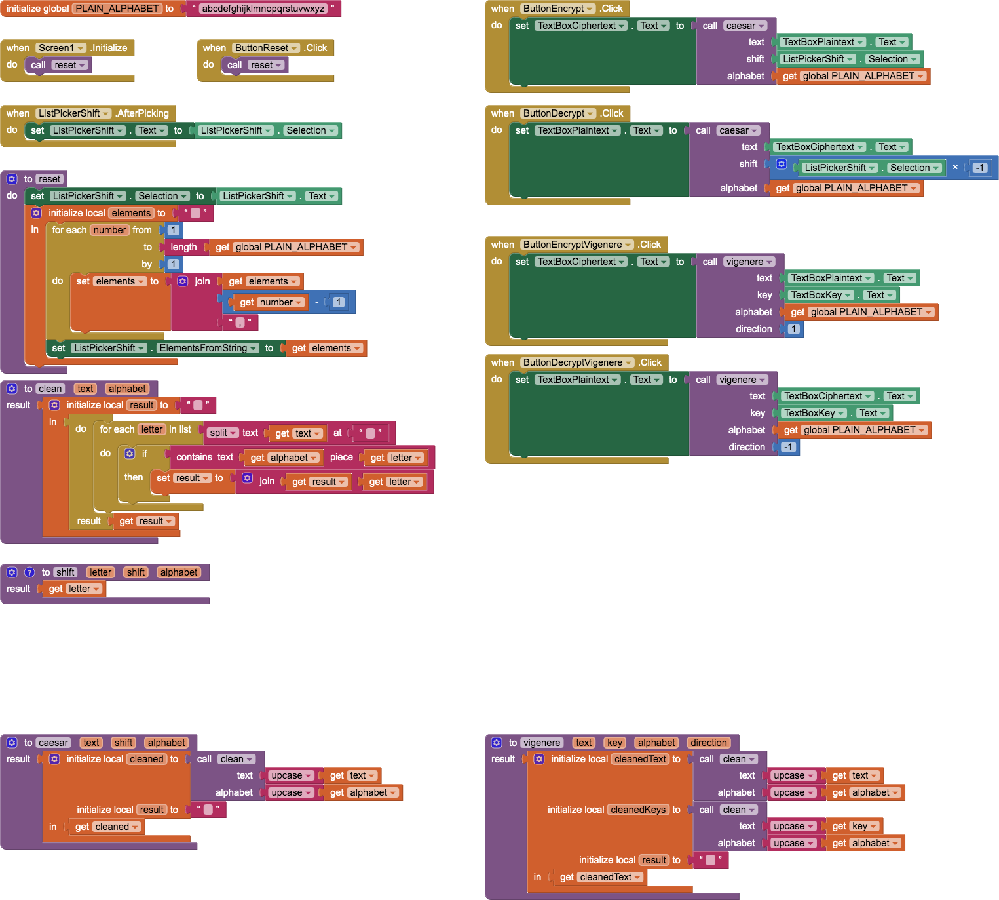
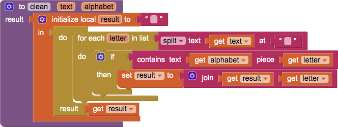

# `CaesarVigenereCipher`

## About this app

`CaesarVigenereCipher` app is an enhancement to the APCSP Mobile [6.5](https://course.mobilecsp.org/mobilecsp/unit?unit=25&lesson=173) [Caesar cipher](https://en.wikipedia.org/wiki/Caesar_cipher) app that includes a [Vigenère cipher](https://en.wikipedia.org/wiki/Vigenère_cipher).   [https://psb-david-petty.github.io/mit-app-inventor/CaesarVigenereCipher/](https://psb-david-petty.github.io/mit-app-inventor/CaesarVigenereCipher/)

## Code

This is a *template* app, with [stubs](http://catb.org/jargon/html/S/stubroutine.html) for `caesar` and `vigenere`, the actual encrypt / decrypt procedures.

- 

As is usual with 

## Designer

All components retain their default properties, except the initial `Text` for the `ListPicker` is `0` on reset &mdash; except `Width` and `Height` set to `Fill parent...` where necessary to center UX components. None of the `TextBox` components are changed on reset.

## Credits

- [Mobile CSP](https://course.mobilecsp.org/) is the [MIT App Inventor](https://appinventor.mit.edu/)-based curriculum for [Advanced Placement&reg; Computer Science Principles](https://apcentral.collegeboard.org/courses/ap-computer-science-principles).

[&#128279; permalink](https://psb-david-petty.github.io/mit-app-inventor/CaesarVigenereCipher/) and [&#128297; repository](https://github.com/psb-david-petty/mit-app-inventor/tree/master/CaesarVigenereCipher) for this page.
