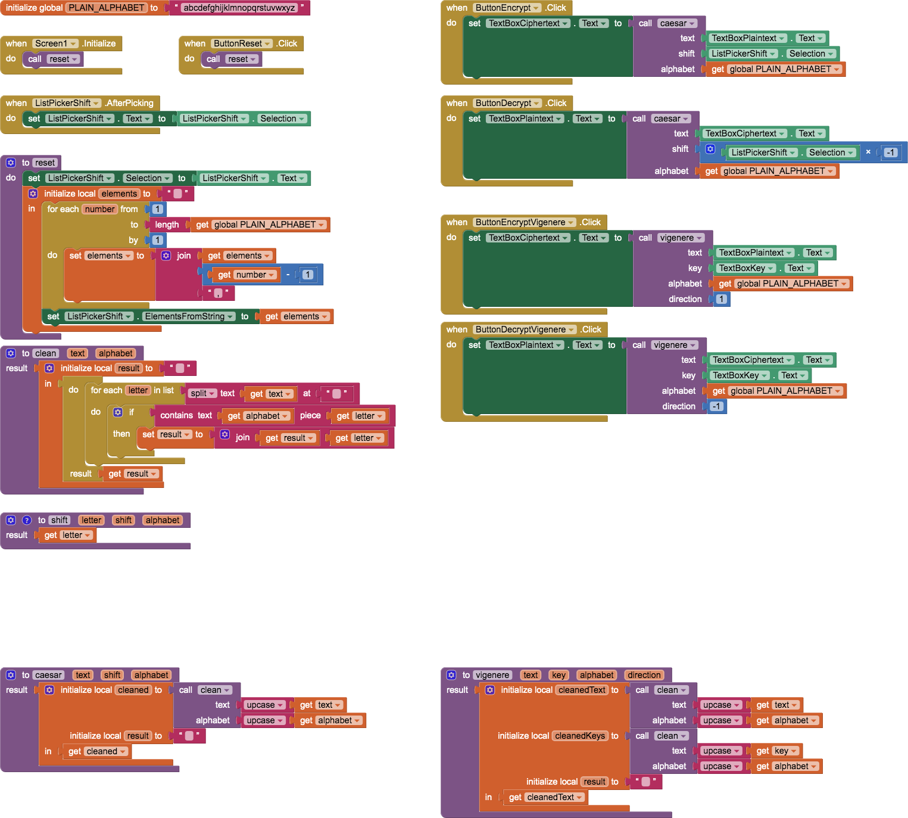
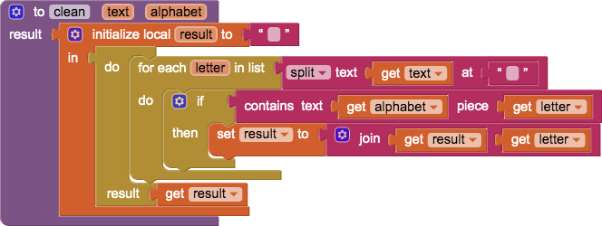

# `CaesarVigenereCipherTemplate`

## About this app

`CaesarVigenereCipherTemplate` app is an enhancement to the APCSP Mobile [6.5](https://course.mobilecsp.org/mobilecsp/unit?unit=25&lesson=173) [Caesar cipher](https://en.wikipedia.org/wiki/Caesar_cipher) app that includes a [Vigenère cipher](https://en.wikipedia.org/wiki/Vigenère_cipher). Enter text in the <tt>Plaintext</tt> or <tt>Ciphertext</tt> fields and use the buttons to encrypt or decrypt. The Caesar `ListPicker` selects the shift. The Vigenère `TextBox` sets the key.

## Code

This is a *template* app, with [stubs](http://catb.org/jargon/html/S/stubroutine.html) for `caesar` and `vigenere` &mdash; the actual encrypt / decrypt procedures &mdash; as well as `shift`.

- Abstracting the `shift` procedure so that it can be called with positive or negative shifts enables it to be used for encrypting and decrypting for both the [Caesar cipher](https://en.wikipedia.org/wiki/Caesar_cipher) and the [Vigenère cipher](https://en.wikipedia.org/wiki/Vigenère_cipher). An approach to implementing a signed `shift` is to use [modulo](https://en.wikipedia.org/wiki/Modulo_operation) &mdash; however, the `modulo of` (and `remainder of`) operation(s) yield results on `[0, n - 1]`, which is not suitable for accessing a list of length `n`, whose indexes are on `[1, n]`. `shift` has...
> Preconditions:
>- `letter` is of length `1`
>- `letter` is in `alphabet`
- `caesar` shifts the `cleaned` text by a fixed amount (`shift`), positively or negatively. `alphabet` establishes the [lexicographical order](https://en.wikipedia.org/wiki/Lexicographical_order) for the letters. `caesar` is an abstraction that can be called from both the *Encrypt* and *Decrypt* `Button`s and is an example of the [accumulator pattern](https://runestone.academy/runestone/books/published/thinkcspy/Functions/TheAccumulatorPattern.html).
- `vigenere` shifts the `cleaned` text by an amount corresponding to the letters of `key`, positively (if `direction` is `1`) or negatively (if `direction` is `-1`). `alphabet` establishes the [lexicographical order](https://en.wikipedia.org/wiki/Lexicographical_order) for the letters. `vigenere` is an abstraction that can be called from both the *Encrypt* and *Decrypt* `Button`s and is an example of the [accumulator pattern](https://runestone.academy/runestone/books/published/thinkcspy/Functions/TheAccumulatorPattern.html).

As is usual with [APCSP Mobile](https://course.mobilecsp.org/) template apps, there is an existing UX and some pre-written procedures provided. The `clean` procedure is an example of the [accumulator pattern](https://runestone.academy/runestone/books/published/thinkcspy/Functions/TheAccumulatorPattern.html). It returns `text` with all characters *not* in `alphabet` removed.

## Designer

All components retain their default properties &mdash; except initial `Text` for the `ListPicker` is `0` on reset and `Width` and `Height` are set to `Fill parent...` where necessary to center UX components. None of the `TextBox` components are changed on reset.

## Credits

- [Mobile CSP](https://course.mobilecsp.org/) is the [MIT App Inventor](https://appinventor.mit.edu/)-based curriculum for [Advanced Placement&reg; Computer Science Principles](https://apcentral.collegeboard.org/courses/ap-computer-science-principles).

[&#128279; permalink](https://psb-david-petty.github.io/mit-app-inventor/CaesarVigenereCipherTemplate/), [&#128297; repository](https://github.com/psb-david-petty/mit-app-inventor/tree/master/CaesarVigenereCipherTemplate), and [{:width="36px"} `.AIA`](https://psb-david-petty.github.io/mit-app-inventor/CaesarVigenereCipherTemplate/CaesarVigenereCipherTemplate.aia) for this page.
