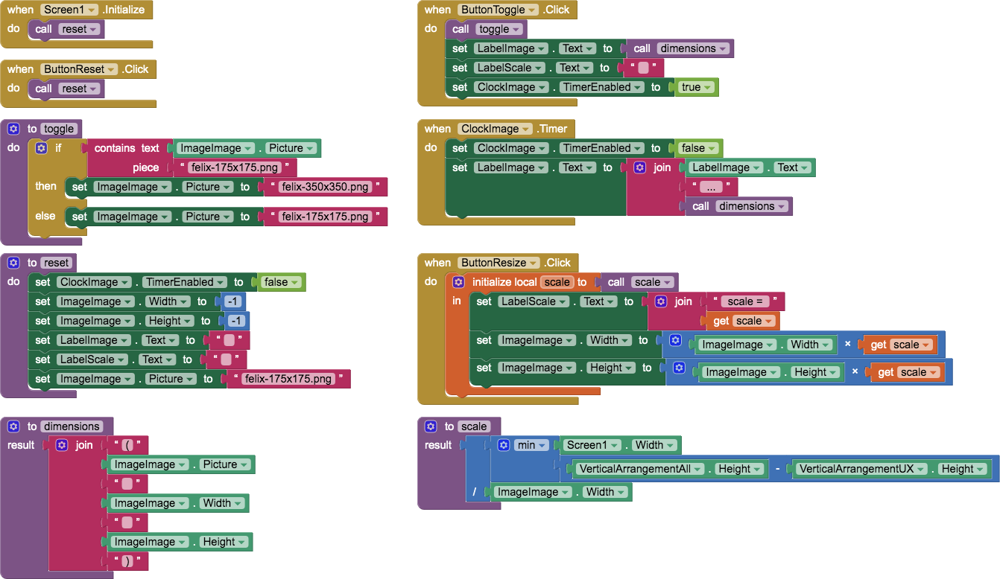

# `ImageSize`

## About this app

The `ImageSize` app demonstrates the delay between changing the size of an `Image` or `Canvas` and the dimensions actually changing. Reset to reset the image. Toggle to toggle the images and display dimensions. Resize to resize the image to full width / height.

## Code

- The *Reset* `Button` sets the `Width` and `Height` properties to `Automatic...` (`-1`) and sets the smaller background image.
- The *Toggle* `Button`toggles the background image and displays the `Image` dimensions. Then, one second later, redisplays the `Image` dimensions.
- The *Resize* `Button` proportionally scales the image to the full height / width of the screen &mdash; whichever is least.

**Moral of this story**: Make sure any `Image` or `Canvas` background images are of the same size so the delay won't affect the size *or* put a `Clock` delay in line with any background-image changes before accessing `Width` and `Height` properties.

## Designer

All components retain their default properties, &mdash; except `Width` and `Height` set to `Fill parent...` where necessary to center UX components.

[&#128279; permalink](https://psb-david-petty.github.io/mit-app-inventor/ImageSize/), [&#128297; repository](https://github.com/psb-david-petty/mit-app-inventor/tree/master/ImageSize), and [{:width="36px"} `.AIA`](https://psb-david-petty.github.io/mit-app-inventor/ImageSize/ImageSize.aia) for this page.
