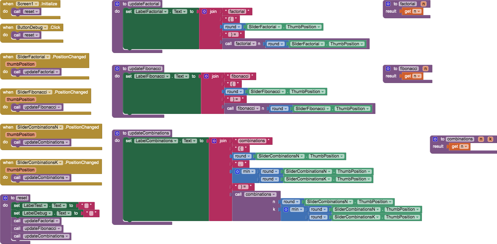

# `RecursionTemplate`

## About this app

The `RecursionTemplate` app is a template for implementing recursive procedures to calulate *factorial*, *Fibonacci* number, and *combinations*. The default return value (before implementing each function) is `n`. Move sliders to recursively calculate `factorial(n)`, `fibonacci(n)`, and `C(n, k)`.

## Code

## Recursion

- [http://catb.org/jargon/html/R/recursion.html](http://catb.org/jargon/html/R/recursion.html) The *Jargon File* definition.
- You can recognize a [recursive procedure / algorithm](https://en.wikipedia.org/wiki/Recursion_(computer_science)) as follows:
  - **The recursive call** &mdash; the procedure / algorithm calls / refers to itself.
  - **The base case** &mdash; results of the procedure / algorithm calculated without recurring.
  - **The inductive step** &mdash; the recursive call with input(s) one step closer to the base case.

The template is for implementing recursive procedures to calulate *factorial*, *Fibonacci* number, and *combinations* defined as follows:

| Description | Definition |
| -- | -- |
| [Factorial](https://oeis.org/A000142) | <a href="https://www.codecogs.com/eqnedit.php?latex=\large&space;f(n)=&space;\begin{Bmatrix}&space;1&space;&&space;n&space;=&space;0&space;\\&space;n&space;\times&space;f&space;\left(&space;n&space;-&space;1&space;\right)&space;&&space;n&space;>&space;0&space;\end{Bmatrix}" target="_blank">&space;0&space;\end{Bmatrix}" title="\large f(n)= \begin{Bmatrix} 1 & n = 0 \\ n \times f \left( n - 1 \right) & n > 0 \end{Bmatrix}" /></a> |
| [Fibonacci](https://oeis.org/A000045) | <a href="https://www.codecogs.com/eqnedit.php?latex=\large&space;f(n)&space;=&space;\begin{Bmatrix}&space;0&space;&&space;n&space;=&space;0&space;\\&space;1&space;&&space;n&space;=&space;1&space;\\&space;f(n&space;-&space;1)&space;&plus;&space;f(n&space;-&space;2)&space;&&space;n&space;>&space;1&space;\end{Bmatrix}" target="_blank">&space;1&space;\end{Bmatrix}" title="\large f(n) = \begin{Bmatrix} 0 & n = 0 \\ 1 & n = 1 \\ f(n - 1) + f(n - 2) & n > 1 \end{Bmatrix}" /></a> |
| [Combinations](https://en.wikipedia.org/wiki/Combination#Number_of_k-combinations) (see [Pascal's Triangle](https://en.wikipedia.org/wiki/Pascal's_triangle)) | <a href="https://www.codecogs.com/eqnedit.php?latex=\large&space;\large&space;\begin{pmatrix}&space;n&space;\\&space;k&space;\end{pmatrix}&space;=&space;\begin{Bmatrix}&space;1&space;&&space;\begin{pmatrix}&space;n&space;\\&space;0&space;\end{pmatrix}&space;\\&space;1&space;&&space;\begin{pmatrix}&space;n&space;\\&space;n&space;\end{pmatrix}&space;\\&space;\begin{pmatrix}&space;n&space;-&space;1&space;\\&space;k&space;-&space;1&space;\end{pmatrix}&space;&plus;&space;\begin{pmatrix}&space;n&space;-&space;1&space;\\&space;k&space;\end{pmatrix}&space;&&space;0&space;\le&space;k&space;\le&space;n&space;\end{Bmatrix}" target="_blank"></a> |

## Designer

All components retain their default properties, &mdash; except all sliders have a `MaxValue` of `12`, a `MinValue` of `0`, a `ThumbPosition` of `6`, and `Width` and `Height` set to `Fill parent...` where necessary to center UX components.

[&#128279; permalink](https://psb-david-petty.github.io/mit-app-inventor/RecursionTemplate/), [&#128297; repository](https://github.com/psb-david-petty/mit-app-inventor/tree/master/RecursionTemplate), and [{:width="36px"} `.AIA`](https://psb-david-petty.github.io/mit-app-inventor/RecursionTemplate/RecursionTemplate.aia) for this page.
