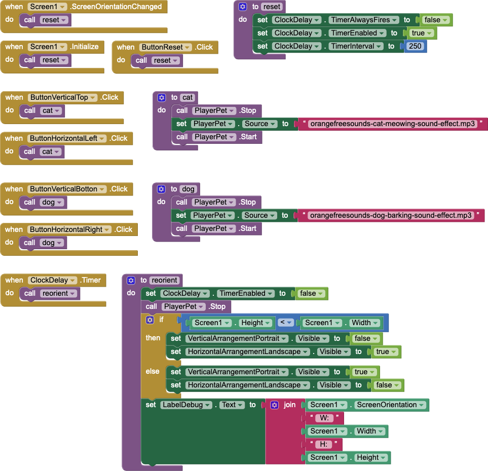

# `Reorient`

## About this app

The `Reorient` app demonstrates the delay between changing the `Screen1` orientation and the `Screen1` dimensions actually changing.

The `Reorient` app reorients arrangements of multiple buttons to be on top of one another in portrait orientation and side by side in landscape orientation.

MIT App Inventor requires a 250ms delay before reading `Screen1.Width` and `Screen1.Height` &mdash; hence the `ClockDelay` component.

Incidentally, The `Reorient` app has two buttons that play a *cat* sound and a *dog* sound with a single `Player`.

## Code

- The *Reset* `Button`, `Screen1.Initialize`, and `Screen1.ScreenOrientationChanged` invoke the `reset` procedure, which simply enables `ClockDelay` for 250ms.
- The `ClockDelay.Timer` event invokes the `reorient` procedure, *which depends on `Screen1.Width` and `Screen1.Height` being correct* &mdash; which only occurs after 250ms.

## Credits

The <a href="https://orangefreesounds.com/cat-meowing-sound-effect/">cat</a> and <a href="https://orangefreesounds.com/dog-barking-sound-effect-free/">dog</a> sounds were downloaded from *Orange Free Sounds* (<a href="https://orangefreesounds.com/">https://orangefreesounds.com/</a>).

## Designer

All components retain their default properties, &mdash; except `Width` and `Height` set to `Fill parent...` where necessary to center UX components and `Button` text(s) changed from their defaults(s).

[&#128279; permalink](https://psb-david-petty.github.io/mit-app-inventor/Reorient/), [&#128297; repository](https://github.com/psb-david-petty/mit-app-inventor/tree/master/Reorient), and [{:width="36px"} `.AIA`](https://psb-david-petty.github.io/mit-app-inventor/Reorient/Reorient.aia) for this page.
