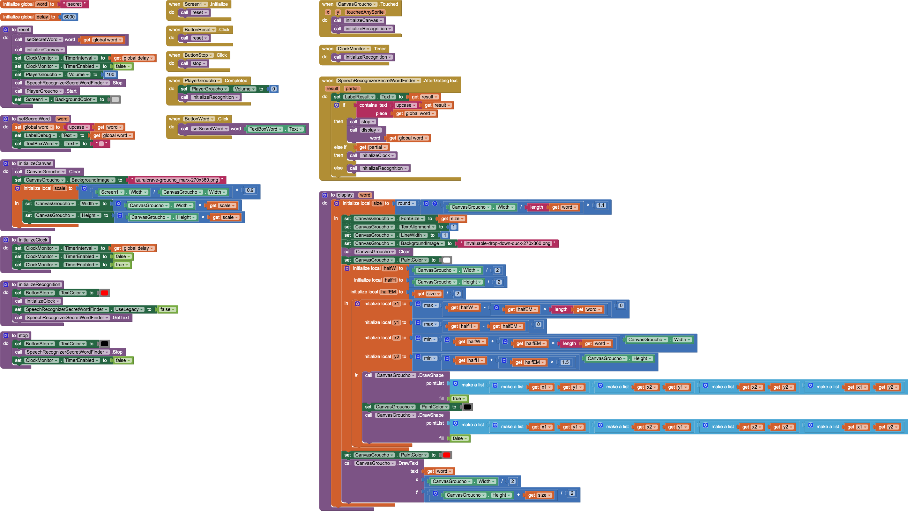
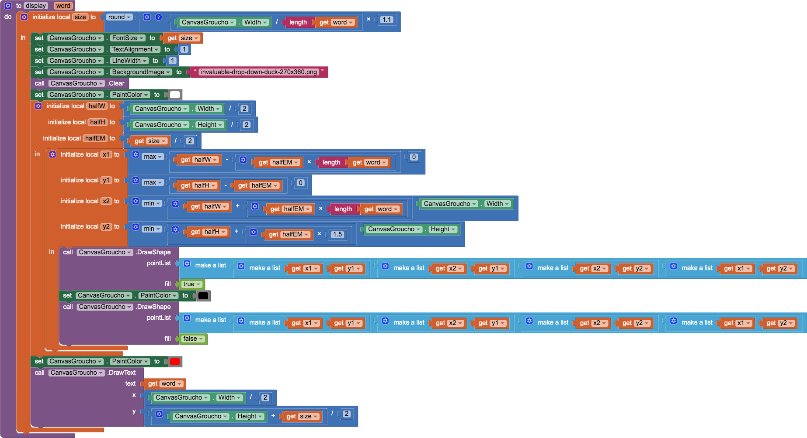

# `SecretWord`

## About this app

`SecretWord` is a speech-recognition app that mirrors the secret word of **[You Bet Your Life](https://en.wikipedia.org/wiki/You_Bet_Your_Life)** (1950–1960) with Groucho Marx. Secret Word to save the text box in the secret word. Stop to stop the speech recognizer. Image to start the speech recognizer. Then just speak!

## Code

- The *Secret Word* `Button` saves the text in the `TextBox` as the *secret word*..
- The *Stop* `Button` stops the `SpeechRecognizer`.
- Touching the image starts the `SpeechRecognizer`.

There were a couple things to learn about continuous speech recogntion in non-legacy mode:

- The `SpeechRecognizer` detects utterances in the background and returns &mdash; in the `AfterGettingText` event &mdash; continuous recogntion `result`s with `partial == true` as long as speech is detected. Once the utterance ends, `partial == false`, so the `SpeechRecognizer` must be restarted.
- If the `SpeechRecognizer` detects *no* speech in the background, it will eventually time out in  5 seconds. In this case, the `SpeechRecognizer` must be restarted by a `Clock` event set to occur *after* that time out &mdash; in this code, the `TimerInterval` is set to 6000 ms (since the utterance time out has been empirically determined to be  5000 ms).
- The `Stop` procedure will stop the `SpeechRecognizer`, but the [documentation](http://ai2.appinventor.mit.edu/reference/components/media.html#SpeechRecognizer.Stop) states that it, *'works only when `UseLegacy` property is set to `false`.'*

`SecretWord` also explores how to write scaled text on a `Canvas` &mdash; embodied in the `display` procedure. 

Vincent De Oliveira (aka iamvdo) describes [font-size](http://iamvdo.me/en/blog/css-font-metrics-line-height-and-vertical-align#lets-talk-about-font-size-first), including how the font metrics define the em-square. The default font (`sans-serif`) has an em-square and `FontSize` that is 110% of the `Canvas` `width` divided by the length of the secret word. It is centered on the `Canvas` (with `TextAlign` centered) and surrounded by a rectangle one em-square tall and length-of-the-secret-word em-squares wide &mdash; clipped to the `Canvas` borders. The text is red within a black rectangle filled with white.

## Designer

All components retain their default properties, &mdash; except `Width` and `Height` set to `Fill parent...` where necessary to center UX components.

## Credits

- Groucho image from [Auralcrave](https://auralcrave.com/en/2017/08/06/groucho-marx-the-genius-anarchist-ai-services-the-comedian/)
- *You Bet Your Life* drop-down duck image from [Invaluable](https://www.invaluable.com/auction-lot/groucho-marx-drop-down-duck-for-the-secret-word-o-983-c-06c4bf2afb)
- 'Say the secret word&hellip;' audio from *You Bet Your Life* [54-18](http://youtu.be/ai9G0Su7lDo), 1955/01/13

[&#128279; permalink](https://psb-david-petty.github.io/mit-app-inventor/SecretWord/), [&#128297; repository](https://github.com/psb-david-petty/mit-app-inventor/tree/master/SecretWord), and [{:width="36px"} `.AIA`](https://psb-david-petty.github.io/mit-app-inventor/SecretWord/SecretWord.aia) for this page.
