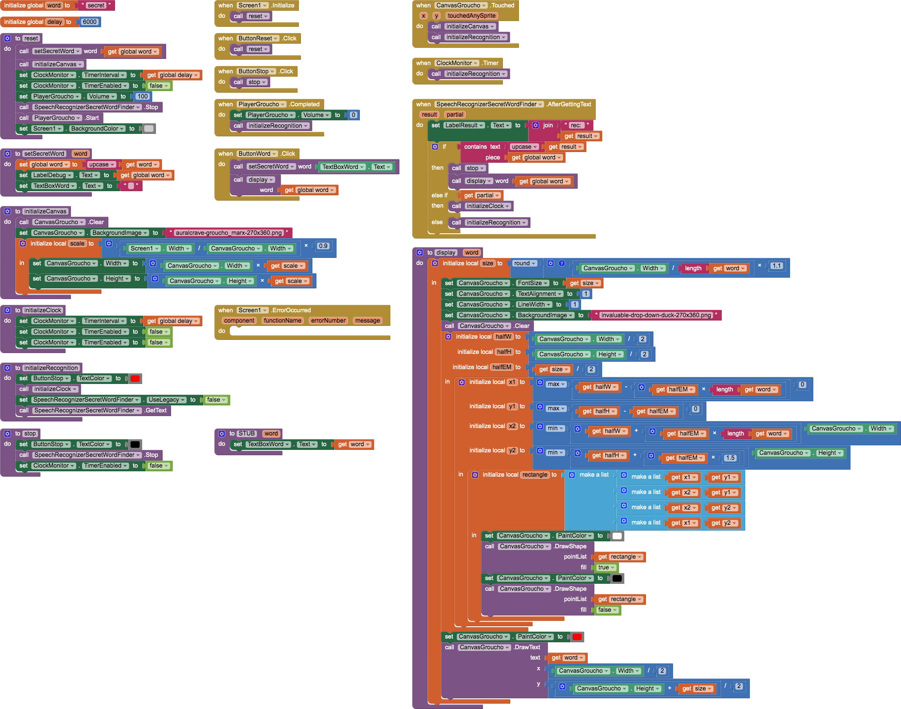
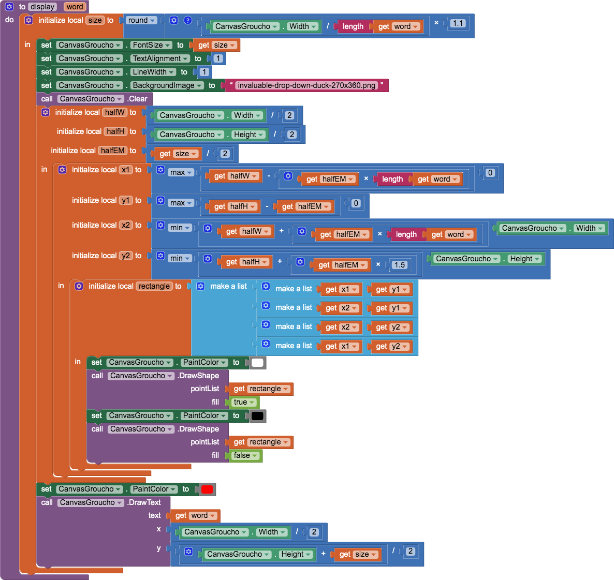

# `SecretWord`

## About this app

`SecretWord` is a speech-recognition app that mirrors the secret word of **[You Bet Your Life](https://en.wikipedia.org/wiki/You_Bet_Your_Life)** (1950–1960) with Groucho Marx. Secret Word to save the text box in the secret word. Stop to stop the speech recognizer. Image to start the speech recognizer. Then just speak!

## Code

- The *Secret Word* `Button` saves the text in the `TextBox` as the *secret word*..
- The *Stop* `Button` stops the `SpeechRecognizer`.
- Touching the image starts the `SpeechRecognizer`.

There were a couple things to learn about continuous speech recogntion in non-legacy mode:

In `SecretWord` I also explored how to write scaled text on a `Canvas` — embodied in the `display` procedure (including a description of [font sizes](http://iamvdo.me/en/blog/css-font-metrics-line-height-and-vertical-align#lets-talk-about-font-size-first)).

## Designer

All components retain their default properties, — except `Width` and `Height` set to `Fill parent...` where necessary to center UX components.

[&#128279; permalink](https://psb-david-petty.github.io/mit-app-inventor/SecretWord/) and [&#128297; repository](https://github.com/psb-david-petty/mit-app-inventor/tree/master/SecretWord) for this page.
